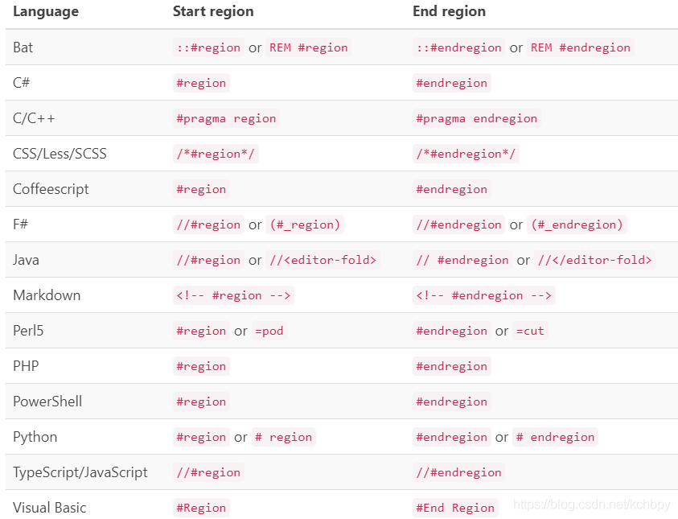

# vue学习
## 总结 summary

### 特殊note

```html
1、修饰符可以连用
// 先阻止默认事件，在阻止冒泡
<button @click="show">
   <a href="http://www.baidu.com" @click.prevent.stop="show">335454345</a>
</button>
show(){
   alert("点击提示");
}
// 以及按键   指定 ctrl+y才生效
<input type="text" placeholder="按下回车提示输入" @keyup.ctrl.y="showInfo">
showInfo(e){
	console.log(e.key,e.keyCode); // 打印 key 和 keyCode ，如果是两个单次，示例CapsLock 则需要切换成 caps-lock
}
```


### 插值语法
```
{{ name }}  // 用于解析标签体内容，例如 <h1></h1>
```
### 指令语法
```
v-bind  // 用于解析标签(标签属性等)  例如 <a v-bind:href></a>
```
### 数据绑定
#### 单向绑定
v-bind
#### 双向绑定
v-model  只能用于输入类表单元素 value 属性

### 事件处理

> v-on 或者 @   示例  =>  v-on:click()      @click()

#### 事件修饰符

> 1、prevent：阻止默认事件    例：url 不让跳转
>
> 2、stop：阻止事件冒泡   例：不让父容器触发
>
> 3、once：事件只触发一次   例：按钮只能点击一次
>
> 4、capture：使用事件的捕获模式   例：让事件在捕获阶段触发，而不是默认的冒泡阶段
>
> 5、self：只有event.target 是当前操作的元素时才触发事件    例：只有触发元素才生效
>
> 6、passive：事件的默认行为立即执行，无需等待事件回调执行完毕   例：scroll 先执行滚动条滚动，后执行函数运算

### vue绑定 html标签
> 1、 el:绑定 例 el:'#root'
> 2、 x.$mount() 例 x.$mount('#root')
### 按键别名

>  回车 =》 enter
>
> 删除 =》 delete
>
> 退出 =》 esc
>
> 空格 =》 space
>
> 换行 =》 tab
>
> 上 =》 up
>
> 下 =》 down
>
> 左 =》 left
>
> 右 =》 right
>
> 示例： input输入框按回车输入里面的内容 
>
> <input type="text" placeholder="按下回车提示输入" @keyup.enter="showInfo">
>
> methods: {
>
> ​      showInfo(e){
>
> ​        // if(e.keyCode !== 13)return; 
>
> ​        console.log(e.target.value);
>
> ​      }
>
> ​    }

### 计算属性和监视属性

#### 计算属性computed

```javascript
computed:{
    fullName:{
        //  get有什么作用？当有人读取fullName时，get就会被调用，且返回值就作为fullName
        //  get什么时候调用 1、初次读取fullName  2、所依赖的数据变化时
        get(){
            return this.firstName+'-'+this.lastName;
        },
            // 当赋值时会触发
            set(){
                console.log("call set method");
            }
    }
},
```

#### 监视变量 watch

```javascript
watch:{
    isHot:{
        // immediate 初始化执行 handler
        immediate:true,
            // 监控的变量发生变化时触发
            handler(newValue,oldValue){
            console.log(newValue,oldValue);
        }
    }
},
```

#### 深度监视 watch =》 deep

>深度监视：
>
>1、Vue中的watch默认不监视对象内部值的变化(一层)
>
>2、配置`deep:true`可以监视对象内部值的变化(多层)
>
>备注：
>
>1、Vue自身可以监视对象内部值的改变，但是Vue提供的watch默认不可以
>
>2、使用watch时根据数据的具体结构，决定是否采用深度监视

```javascript
number:{
    // 深度监视 默认false  false情况下不会监视对象内部属性变化
    // deep:true,
    handler(newValue,oldValue){
        console.log("值发生变化了");
    }
},
```

#### 区分和总结

```java
computed 和 watch 之间的区别
	1、computed 能完成的功能，watch都可以完成。
	2、watch 能完成的功能，computed 不一定能完成：例如watch可以进行异步操作
两个重要的小原则：
	1、所被vue管理的函数，最好写成普通函数，这样this的指向才是vm或组件实例对象
    2、所有不被vue所管理的函数（定时器的回调函数、ajax的回调函数、Promise的回调函数等），最好写成箭头函数，这样this的指向才是vm或者组件实例对象
```

### 绑定 style和class样式

```java
class样式：
    写成 :class="xxx"  xxx可以是字符串、对象、数组
    1、字符串写法适用于：类名不确定，要动态获取
	2、数组写法适用于：要绑定多个样式，个数不确定，名字也不确定
    3、对象写法适用于：要绑定多个样式，个数确定，名字也确定，但不确定使用不使用
style样式：
    :style="{fontSize: xxx}" 其中 xxx为动态值
	:style="[a,b]"  其中 a、b是样式对象
```

### 条件渲染

```java
1、v-if 
    写法：
    	1) v-if="表达式"
		2) v-else-if="表达式"
        3) v-else
     适用于:切换频率较低的场景
     特点:不展示的DOM元素直接被移除
	 注意:v-if可以和v-else-if、v-else一起使用，但要求结构不能被打断
2、v-show
	写法: v-show="表达式"
	适用于:切换频率较高的场景
	特点:不展示的DOM元素未被移除，仅仅是使用样式隐藏
```

### 列表渲染

#### v-for

```java
v-for指令
    1、用于展示列表数据
    2、语法 v-for="(item,index) in xxx" :key="item.id"
    3、可遍历：数组、对象、字符串(用的很少)、指定次数(用的很少)
```


#### react、vue中的key有什么作用？(key的内部原理)

```java
1、虚拟DOM中key的作用：
    key是虚拟DOM对象的标识，当数据发生变化时，Vue会根据【新数据】生成【新的虚拟DOM】，随后Vue进行【新虚拟DOM】与【旧虚拟DOM】的差异比较，比较规则如下：
2、比较规则：
    (1)、旧的虚拟DOM中找到了与新虚拟DOM相同的key
    	1）若虚拟DOM中内容没变，则直接使用之前真是的DOM
    	2）若虚拟DOM中内容变了，则生成新的真实的DOM，随后替换掉页面中之前的真实DOM
	(2)、旧虚拟DOM中未找到与新虚拟DOM相同的key
		1）创建新的真实DOM，随后渲染到页面
3、用index做key可能引发的问题：
	1、若对数据进行：逆序添加、逆序删除等破坏顺序的操作会产生没有必要的真实DOM更新  ==>  界面效果没问题，但效率低
    2、如果结构中还包含输入类的DOM：会产生错误DOM更新   ==> 界面有问题(输入框文字匹配问题)
4、开发中如何选择key? 
	1、最好使用每条数据的唯一标识作为key，比如id、手机号、身份证号等
	2、如果不存在对数据的逆序添加、逆序删除等破坏顺序的操作，仅用于渲染列表用于展示，使用index作为key是没有问题的。
```

#### vue数据监视原理

```java
1、vue会监视data中所有层次的数据
2、如何监视对象中的数据？
	通过setter实现监视，且要在new Vue时就传入要检测的数据
    1）对象中后追加的属性，Vue默认不做响应式处理
	2）如果需要给后添加的属性做响应式，请使用如下API：
    	Vue.set(target,propertyName/index,value)
		vm.$set(target,propertyName/index,value)
3、如何检测数组中的数据？
	通过包裹数组更新元素的方法实现，本质就是做了两件事：
    1）调用原生对应的方法对数组进行更新
	2）重新解析模板，进行更新页面
4、在vue修改数组中的某个元素一定要用如下方法
	1）使用这些API：push()、pop()、shift()、unshift()、splice()、sort()、reverse()
	2）Vue.set() 或 vm.$set()
特别注意：Vue.set() 和 vm.$set() 不能给 vm或 vm的根数据对象 添加属性
```


## 开发工具
### vs code
#### 常用插件
> open in brouser   //  打开页面
> HTML Snippets  // 提示 html 标签
> Live Server // 默认开启本机服务器  内置服务器
> vue  // vue  语法高亮
> Vue 3 Snippets  // vue 标签提示
>
> Tabout   // 跳括号、引号等，跟 idea tab键类似功能
>
> JavaScript (ES6) code snippets
>
> HTML CSS Support
>
> vue helper   // vue 编码提示插件

==待尝试==

> Bracket Jumper // 快速跳括号


#### 常用快捷键 
+ 换行 ctrl+ enter
+ html 页面   按`!`，然后按`tab` 会填充html的基本内容
+ 选中多行，或者多行同时输入，  `alt`键
+ 代码块折叠 `#region` 和 `#endregion`     `javascript`中有用
+ 快捷删除一行，默认`ctrl+shift+k`，修改成`ctrl+y`
+ 代码注解



#### vs code 自定义模板

[参考](https://blog.csdn.net/weixin_44592912/article/details/97641835)

> file > preferences  > user snippets      // 或者  文件 >  首选项  > 用户片段
>
> 输入 html ，选择 html.json


##### vue 模板

```json
// 引用方式   在.html文件中，输入prefix前缀然后按 tab键即可
//    /t 相当于 tab
{
    "Print to console": {
        "prefix": "vue",
        "body": [	
			"<div id='yichen'>",
			"",
    		"</div>",

            "<template id=''>",
			"\t<div >",
			"\t",
			"\t</div>",
            "</template>",
			"",
			"<script src='/node_modules/vue/dist/vue.js'></script>",
			"<script src='/node_modules/vue-resource/dist/vue-resource.js'></script>",
			"<script src='/node_modules/vue-router/dist/vue-router.js'></script>",
            "<script>",
            "",
			"var vm=new Vue({",
			"\tel:'#yichen',",
            
			"\tdata: {",
			"\t",
			"\t},",
            "\tmethods: {",
            "\t",
            "\t},",
			"\tdirectives: {",
			"\t",
			"\t},",
			"\tcomponents: {",
			"\t",
			"\t},",
			"\tfilters: {",
			"\t",
			"\t},",
            "})",
            "</script>",

        ],
        "description": "vue template"
    }
}
```

